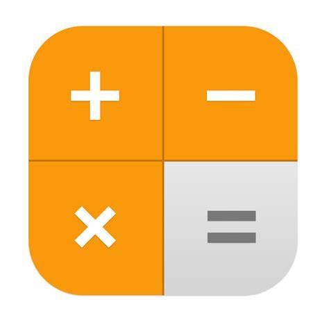

<a name="readme-top"></a>

<div align="center">
  
  <br/>
  <h3><b>Calculator App</b></h3>
</div>
<br>

# 📗 Table of Contents

- [📖 About the Project](#about-project)
  - [🛠 Built With](#built-with)
    - [Tech Stack](#tech-stack)
    - [Key Features](#key-features)
  - [🚀 Live Demo](#live-demo)
- [💻 Getting Started](#getting-started)
  - [Setup](#setup)
  - [Prerequisites](#prerequisites)
  - [Install](#install)
  - [Usage](#usage)
  - [Run tests](#run-tests)
  - [Deployment](#deployment)
- [👥 Authors](#authors)
- [🔭 Future Features](#future-features)
- [🤝 Contributing](#contributing)
- [⭐️ Show your support](#support)
- [🙏 Acknowledgements](#acknowledgements)
- [❓ FAQ (OPTIONAL)](#faq)
- [📝 License](#license)


# 📖 Leaderboard <a name="about-project"></a>

This is a SPA webapp showcasing a calcular made with React

## 🛠 Built With <a name="built-with"></a>

- HTML
- CSS
- JavaScript
- React

### Tech Stack <a name="tech-stack"></a>

We are using HTML, CSS, Javascript and React in this project.

<details>
  <summary>Client</summary>
  <ul>
    <li><a href="https://html5.org/">HTML</a></li>
    <li><a href="https://www.w3.org/Style/CSS/Overview.en.html">CSS</a></li>
    <li><a href="https://developer.mozilla.org/en-US/docs/Web/javascript">JavaScript</a></li>
    <li><a href="https://react.dev/">React</a></li>
  </ul>
</details>


### Key Features <a name="key-features"></a>

- Created a  React app with create react app command
- Added linters
- Added Javascript files

<p align="right">(<a href="#readme-top">back to top</a>)</p>


## 🚀 Live Demo <a name="live-demo"></a>

Underconstruction

<p align="right">(<a href="#readme-top">back to top</a>)</p>

## Loom Walkthrough

Underconstruction

## 💻 Getting Started <a name="getting-started"></a>

To get a local copy up and running, follow these steps.

### Prerequisites

In order to run this project you need:

- Code Editor
- git installed

### Setup

Clone this repository to your desired folder:

```sh
  cd my-folder
  git clone https://github.com/firepicaso/mm_calculator.git
```

### Install

Install this project with:

```sh
  cd my-project
  npm install
```
--->

### Usage

To run the project, execute the following command:

open index.html using the live server. Currently it only shows a welcome message.

### Run tests

Under construction

### Deployment

Please check the Event Portal throug this link

<p align="right">(<a href="#readme-top">back to top</a>)</p>


## 👥 Authors <a name="authors"></a>

👤 **FirePicaso**

- GitHub: [@githubhandle](https://github.com/firepicaso)
- LinkedIn: [LinkedIn](https://www.linkedin.com/in/mustakim-masum/)

<p align="right">(<a href="#readme-top">back to top</a>)</p>

## 🔭 Future Features <a name="future-features"></a>

- Underconstruction

<p align="right">(<a href="#readme-top">back to top</a>)</p>

## 🤝 Contributing <a name="contributing"></a>

Contributions, issues, and feature requests are welcome!

Feel free to check the [issues page](../../issues/).

<p align="right">(<a href="#readme-top">back to top</a>)</p>


## ⭐️ Show your support <a name="support"></a>

If you like this project give it a star

<p align="right">(<a href="#readme-top">back to top</a>)</p>


## 🙏 Acknowledgments <a name="acknowledgements"></a>

I would like to thank Microverse for this opportunity

<p align="right">(<a href="#readme-top">back to top</a>)</p>


## 📝 License <a name="license"></a>

This project is [MIT](./LICENSE) licensed.

<p align="right">(<a href="#readme-top">back to top</a>)</p>